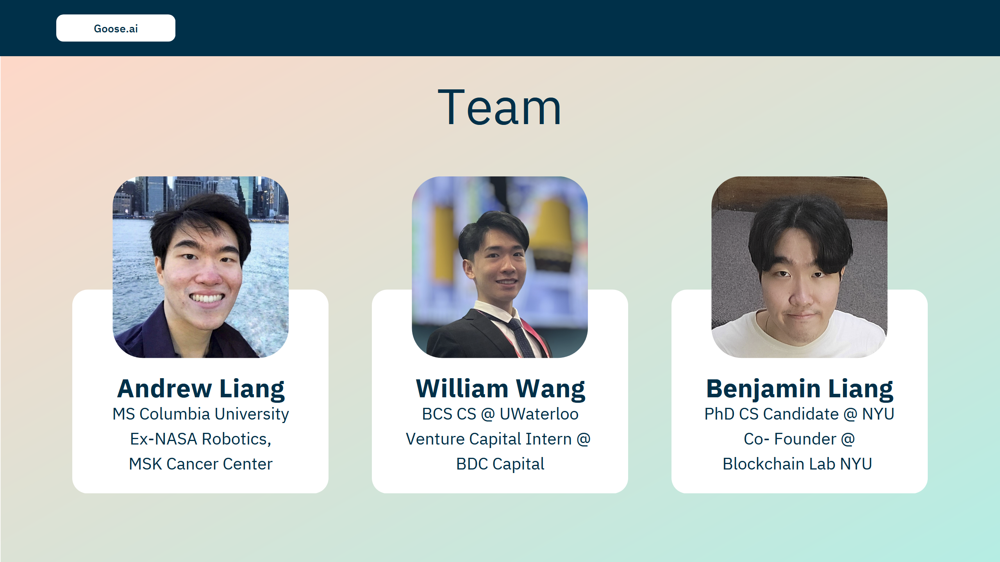

# 🍁 Goose.ai

### Goose.ai brings Web3 accessibility to mobile, Discord, Slack, and Telegram!

#### Mission: Onboarding the next billion Web3 users, regardless of platform and technical expertise restrictions

## 💡 Inspiration 

**The barrier of entry to Web3 is** ***HIGH.*** On September 26, 2022, The Ontario Securities Commission published a Crypto Asset Survey Report and found that amongst Canadians:

* the average crypto asset knowledge score was 37%
* few felt particularly familiar with crypto
* most lacked a working knowledge of the practical, legal, or regulatory dimensions of crypto assets

And this is just crypto, arguably the most publicly recognizable part of the Web3 umbrella. So how do we lower the barrier of entry to crypto, blockchain, and Web3 services? With **Goose.ai**! 🤖

## ❓ What it does

**Goose.ai** is a multipurpose, platform-agnostic tool that uses an LLM-driven chatbot to lower the barrier of entry to Web3 services and blockchain data visualization tools. Ask questions about specific Web3 technologies, get insights on data feeds (subgraphs), and **make blockchain state changes** all through chat.

**Login** with WorldCoin or MetaMask to access our chatbot [here](https://goose-ai.netlify.app).

**Access** our Dashboard via our chatbot or [directly](https://goosedashboard.streamlit.app/).

## 🚧 How we built it 

Technologies Used: WorldCoin login, Gnosis Safe, Polygon, IPFS, Web3.Storage, The Graph subgraphs, AirStack APIs, UMA Protocol, Quicknode, NounsDAO, Highlight

1. We are leveraging **[WorldCoin's World ID](https://github.com/saccharinedreams/Goose.ai/blob/main/sponsors/WorldCoin.md)** to provide secure authentication login for our POAP minting webpage! (We don't want people or bots spamming our POAP minting and taking it away from genuine users)
   
2. We leveraged **[Quicknode](https://github.com/saccharinedreams/Goose.ai/blob/main/sponsors/Quicknode.md)'s NFT API** to allow all 650 hackers to mint their own ETHWaterloo 2023 POAP via chat using Goose.ai on the Polygon mainnet and testnet!
     - Mint your own ETHWaterloo 2023 POAP via text using Goose.ai **([Quicknode](https://github.com/saccharinedreams/Goose.ai/blob/main/sponsors/Quicknode.md) NFT API, [Polygon](https://github.com/saccharinedreams/Goose.ai/blob/main/sponsors/Polygon.md))**.
     - Choose from:
       - a **Noun** unique to your wallet address **([Nouns](https://github.com/saccharinedreams/Goose.ai/blob/main/sponsors/NounsDAO.md)-API)**.
       - a classic Mr. Goose GIF if you want the original image.
       - an AI generated Mr. Goose image with any traits you want OpenAI's Text-To-Image model (Eden AI API).
      
3. Backup your NFTs on any chain through chat **([IPFS and Web3.storage](https://github.com/saccharinedreams/Goose.ai/blob/main/sponsors/IPFS.md))**

4. Data visualization dashboard (Streamlit app)
     - Monitor your Gnosis Safe wallet's transactions, ownership status, creation date and more! **([Gnosis](https://github.com/saccharinedreams/Goose.ai/blob/main/sponsors/Gnosis.md), [The Graph](https://github.com/saccharinedreams/Goose.ai/blob/main/sponsors/TheGraph.md))**
        - Find trends using our interactive plotting feature using data from the Gnosis Safe subgraph
        - Enter your Gnosis Safe wallet address or transaction address to get information instantly
        - Download the data you selected as a .csv
     - Monitor UMA Mainnet Voting Entities **([UMA Protocol](https://github.com/saccharinedreams/Goose.ai/blob/main/sponsors/UMA%20Protocol.md), [The Graph](https://github.com/saccharinedreams/Goose.ai/blob/main/sponsors/TheGraph.md))**
        -  Retrieve data about: User, PriceIdentifier, PriceRequest, PriceRequestRound, VoterGroup, CommittedVote, RevealedVote, RewardsClaimed
           -  Find the users who vote the most
           -  Find the users who vote *correctly* the most
           -  Sort data by PriceRequest value
           -  Look up details about any individual user
  
5. We also minted a "Rotating Mr. Goose" Generative NFT Collection using **[Highlight](https://github.com/saccharinedreams/Goose.ai/blob/main/sponsors/highlight.md)**!

6. All of the above features are available on Web, Mobile, Slack, Discord, and Telegram!

Check out our [ETHGlobal page](https://ethglobal.com/showcase/goose-ai-3tgh9)! Goose.ai is an [ETHGlobal Waterloo](https://ethglobal.com/events/waterloo2023) project.

## Pitch and Demo Video

👀 [Slide Deck](https://www.canva.com/design/DAFm0gA7A6E/P_qN1To6Gd56CNIkA6JSiw/view?utm_content=DAFm0gA7A6E&utm_campaign=designshare&utm_medium=link&utm_source=publishsharelink)

## The Team

